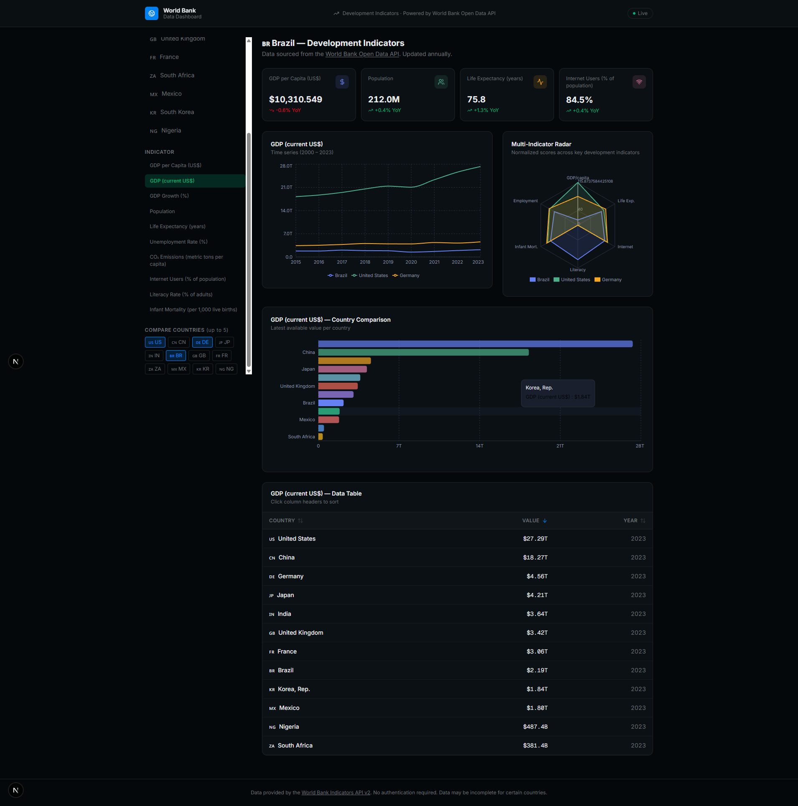
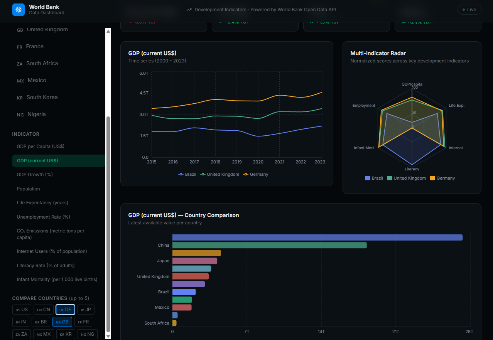
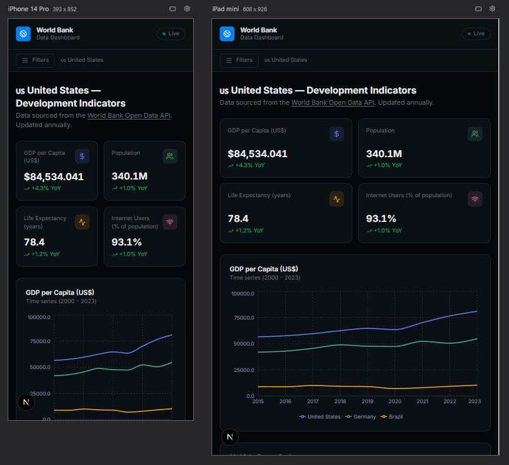

# The World Bank Data Dashboard

An interactive, responsive dashboard that visualizes development indicators from the **World Bank Indicators API v2**. Built with Next.js 15 (App Router), TypeScript, Recharts, and shadcn/ui.

---

## Live Demo

Deploy to [Vercel](https://theworldbankdashboard.vercel.app/) with a single click — no environment variables or API keys required.

---

## Features

| Feature | Details |
|---|---|
| **4 Chart Types** | Line (time-series), Horizontal Bar (country comparison), Radar (multi-indicator), KPI cards |
| **10 Indicators** | GDP per capita, Total GDP, GDP growth, Population, Life expectancy, Unemployment, CO2 emissions, Internet users, Literacy rate, Infant mortality |
| **12 Countries** | US, China, Germany, Japan, India, Brazil, UK, France, South Africa, Mexico, South Korea, Nigeria |
| **Filters** | Primary country, indicator selector, reference year, multi-country comparison (up to 5) |
| **Responsive** | Mobile-first layout with collapsible sidebar on small screens |
| **Accessible** | ARIA roles/labels, keyboard navigation, screen-reader-friendly |
| **Error handling** | Per-chart error states with user-friendly messages |
| **No auth required** | The World Bank API is completely open — no API key needed |

---

## Tech Stack

- **Framework**: [Next.js 16](https://nextjs.org) (App Router, TypeScript)
- **Charts**: [Recharts](https://recharts.org) via shadcn/ui chart conventions
- **UI Components**: [shadcn/ui](https://ui.shadcn.com)
- **Styling**: [Tailwind CSS v4](https://tailwindcss.com)
- **Icons**: [Lucide React](https://lucide.dev)
- **API**: [World Bank Indicators API v2](https://datahelpdesk.worldbank.org/knowledgebase/articles/889392)

---

## Project Structure

```
.
├── app/
│   ├── layout.tsx           # Root layout with Inter font and metadata
│   ├── page.tsx             # Entry point — renders header + dashboard
│   └── globals.css          # Design tokens (dark analytics theme)
├── components/
│   └── dashboard/
│       ├── DashboardHeader.tsx      # Sticky top navigation bar
│       ├── DashboardFilters.tsx     # Sidebar filter controls
│       ├── DashboardClient.tsx      # Main client controller (state + fetching)
│       ├── StatsCards.tsx           # 4 KPI summary cards
│       ├── TimeSeriesChart.tsx      # Multi-line time-series chart
│       ├── CountryBarChart.tsx      # Horizontal bar comparison chart
│       ├── CountryRadarChart.tsx    # Spider/radar multi-indicator chart
│       └── DataTable.tsx            # Sortable data table
├── lib/
│   └── worldbank-api.ts     # API service layer (fetch helpers, types, formatters)
└── README.md
```

---

## Data Flow

```
User selects filters
       │
       ▼
DashboardClient (client component)
       │
       ├── fetchIndicatorByCountry()         → StatsCards
       ├── fetchIndicatorMultipleCountries() → TimeSeriesChart
       ├── fetchIndicatorMultipleCountries() → CountryBarChart + DataTable
       └── fetchIndicatorMultipleCountries() → RadarChart (normalized 0-100)
```

All API calls use `fetch` with `next: { revalidate: 3600 }` for ISR caching.

---

## API Reference

Base URL: `https://api.worldbank.org/v2`

All endpoints return JSON when appended with `?format=json`.  
No API key or authentication is required.

### Endpoints Used

| Endpoint | Description |
|---|---|
| `GET /v2/country/{code}/indicator/{id}?date={range}&format=json` | Time-series for a single country |
| `GET /v2/country/{codes}/indicator/{id}?date={range}&format=json` | Multi-country (semicolon-separated codes) |

### Example

```
https://api.worldbank.org/v2/country/US;DE;CN/indicator/NY.GDP.PCAP.CD?date=2015:2023&format=json
```

---

## Testing

The project includes unit tests for the API service layer using **Jest**.

### Run Tests

To execute the unit tests, run:

```bash
npm test
```

The tests cover:
- Fetching indicator data for a single country.
- Fetching indicator data for multiple countries.
- API response parsing and formatting.

Test files are located in `lib/__tests__/`.

### Response Shape

```json
[
  { "page": 1, "pages": 1, "per_page": 300, "total": 9 },
  [
    {
      "indicator": { "id": "NY.GDP.PCAP.CD", "value": "GDP per capita (current US$)" },
      "country": { "id": "US", "value": "United States" },
      "date": "2023",
      "value": 76399.38
    }
  ]
]
```

### Key Indicator Codes

| Code | Description |
|---|---|
| `NY.GDP.MKTP.CD` | GDP (current US$) |
| `NY.GDP.PCAP.CD` | GDP per capita |
| `NY.GDP.MKTP.KD.ZG` | GDP growth rate (%) |
| `SP.POP.TOTL` | Total population |
| `SP.DYN.LE00.IN` | Life expectancy at birth |
| `SL.UEM.TOTL.ZS` | Unemployment rate (%) |
| `EN.ATM.CO2E.PC` | CO2 emissions per capita |
| `IT.NET.USER.ZS` | Internet users (%) |
| `SE.ADT.LITR.ZS` | Adult literacy rate (%) |
| `SP.DYN.IMRT.IN` | Infant mortality rate |

---

## Getting Started

### Prerequisites

- Node.js 18+
- npm (recommended)

### Installation
Clone the repository

```bash
# Install dependencies
npm install

# Run the development server
npm dev
```

Open [http://localhost:3000](http://localhost:3000) in your browser.

---

## Design Decisions

### Dark Analytics Theme
The dashboard uses a dark theme inspired by professional analytics tools (Vercel Analytics, Datadog). Colors are defined as semantic CSS custom properties in `globals.css` and mapped through Tailwind's `@theme inline` block.

### No External State Management
All state lives in `DashboardClient` using React `useState` + `useCallback` + `useEffect`. SWR was not used here since each indicator combination requires a fresh API call rather than shared cache keys — this keeps the implementation simple and dependency-light.

### Radar Chart Normalization
The radar chart normalizes each indicator to a 0–100 score using known global min/max reference ranges. For "lower is better" metrics (infant mortality, unemployment), the scale is inverted so that higher scores always mean better outcomes.

### Error Boundaries per Chart
Each chart component independently handles `isLoading` / `error` / `empty` states rather than using a global error boundary, which gives users partial data when only some API calls fail.

---

## Accessibility

- All interactive elements are keyboard-navigable (Tab, Enter, Space)
- Sort buttons and filter controls use `aria-label`, `aria-pressed`, `aria-checked`
- Charts are wrapped in `role="img"` with descriptive `aria-label`
- Loading and error states use `role="status"` and `role="alert"` with `aria-live`
- Screen-reader-only text (`.sr-only`) is used for flag emojis and country codes

---


## Images



